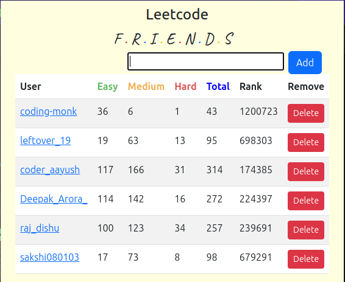

# Leetcode Friends Chrome Extension

## Description

Leetcode Friends is a Chrome extension that provides valuable insights into your LeetCode progress and ranking. It takes a LeetCode username as input and displays a table with the total number of questions solved, categorized by difficulty (easy, medium, hard), and your current rank.

This extension utilizes HTML and JSON to create a user-friendly interface and fetches data from the [LeetCode Stats API](https://leetcode-stats-api.herokuapp.com/) provided by the respective author.

## How to Use

Follow the steps below to use the Leetcode Friends Chrome extension:

1. **Installation**:
   - Download the extension files from the [repository](https://github.com/leftover19/LeetocdeFriends)
   - Unzip the downloaded file to a folder on your computer.

2. **Add the Extension to Chrome**:
   - Open Google Chrome and type `chrome://extensions/` in the address bar.
   - Enable the "Developer mode" using the toggle switch located at the top right corner of the page.
   - Click on "Load unpacked" and select the folder where you unzipped the extension files.

3. **Access the Extension**:
   - Once the extension is added, you'll see the Leetcode Friends icon  in the Chrome toolbar.

4. **Getting LeetCode Statistics**:
   - Click on the Leetcode Friends icon  to open the extension popup.
   - Enter LeetCode username in the provided input field.
   - Click the "Add" button.

5. **View Your Statistics**:
   - The extension will fetch data from the LeetCode Stats API and display a table with the following information:
     - Total questions solved.
     - Number of easy, medium, and hard questions solved.
     - Your current rank.

6. **Deleting User Data**:
   - To delete your user data from the extension, click on "Delete" button.

## Credits

The Leetcode Friends Chrome extension utilizes the [LeetCode Stats API](https://leetcode-stats-api.herokuapp.com/) provided by the respective author.
Please note that this extension is not officially affiliated with LeetCode. It is a personal project developed by [leftover19](https://github.com/leftover19/) and intended for personal use.

**Enjoy tracking your LeetCode progress with Leetcode Friends!**
